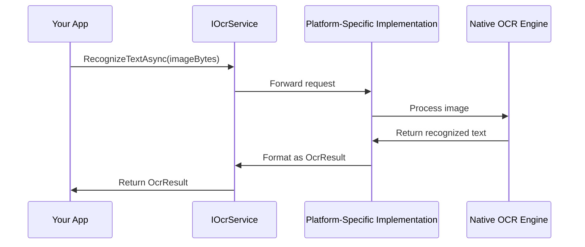

# Chapter 1: IOcrService Interface

## Introduction

Have you ever needed to extract text from an image in your app? Maybe you want to scan a receipt, recognize text from a business card, or read a document without typing it all out manually. This is where Optical Character Recognition (OCR) comes in!

In this chapter, we'll explore the `IOcrService` interface, which is the foundation of our OCR library. Think of it as the blueprint that defines what our OCR service can do, regardless of which platform (Android, iOS, Windows) your app is running on.

## What Problem Does IOcrService Solve?

Imagine you're building a receipt scanning app. On different platforms (iOS, Android, Windows), the underlying OCR technology works differently:

- iOS might use Apple's Vision framework
- Android might use Google's ML Kit
- Windows might use a different OCR engine

Without a common interface, you'd need to write different code for each platform. That's where `IOcrService` comes in - it provides a consistent way to perform OCR operations across all platforms.

## Understanding IOcrService Through an Analogy

Think of `IOcrService` as a universal remote control for different TVs:

- Different TV brands (Samsung, LG, Sony) are like different platforms (iOS, Android, Windows)
- But the remote's buttons (power, volume, channel) work the same way for all TVs
- Similarly, `IOcrService` methods work the same way across all platforms

## Key Components of IOcrService

Let's break down the main parts of the `IOcrService` interface:

### 1. Core Methods

```csharp
Task<OcrResult> RecognizeTextAsync(byte[] imageData, bool tryHard = false, CancellationToken ct = default);

Task<OcrResult> RecognizeTextAsync(byte[] imageData, OcrOptions options, CancellationToken ct = default);

Task StartRecognizeTextAsync(byte[] imageData, OcrOptions options, CancellationToken ct = default);
```

These methods allow you to:
- Pass an image (as byte array)
- Get recognized text back (as an `OcrResult`)
- Configure how the recognition works (using `OcrOptions`)

### 2. Event for Asynchronous Recognition

```csharp
event EventHandler<OcrCompletedEventArgs> RecognitionCompleted;
```

This event is triggered when OCR recognition completes, allowing your app to respond accordingly.

### 3. Language Support

```csharp
IReadOnlyCollection<string> SupportedLanguages { get; }
```

This property tells you which languages the OCR service can recognize.

### 4. Initialization

```csharp
Task InitAsync(CancellationToken ct = default);
```

This method initializes the OCR service on the current platform.

## Using IOcrService: A Simple Example

Let's see how you might use `IOcrService` to extract text from an image:

```csharp
// 1. Get access to the OCR service
IOcrService ocrService = /* we'll learn how to get this in later chapters */;

// 2. Initialize the service
await ocrService.InitAsync();

// 3. Load an image (for example, from a file)
byte[] imageBytes = File.ReadAllBytes("receipt.jpg");

// 4. Recognize text in the image
OcrResult result = await ocrService.RecognizeTextAsync(imageBytes);

// 5. Use the recognized text
if (result.Success)
{
    Console.WriteLine("Recognized text: " + result.AllText);
    
    // Print each line separately
    foreach (string line in result.Lines)
    {
        Console.WriteLine($"Line: {line}");
    }
}
```

This code will:
1. Initialize the OCR service
2. Load an image from a file
3. Extract text from the image
4. Print the recognized text if successful

## Advanced Usage with Options

For more control over the OCR process, you can use `OcrOptions`:

```csharp
// Create options for OCR
var options = new OcrOptions(
    language: "en", // English language
    tryHard: true,  // More accurate but slower
    patternConfig: new OcrPatternConfig(
        regexPattern: @"\d{3}-\d{2}-\d{4}", // Pattern for SSN
        validationFunction: text => text.Length == 11
    )
);

// Recognize text with options
OcrResult result = await ocrService.RecognizeTextAsync(imageBytes, options);

// Check if any patterns were matched
if (result.MatchedValues.Count > 0)
{
    Console.WriteLine($"Found SSN: {result.MatchedValues[0]}");
}
```

This example shows how to:
1. Create OCR options with a specific language and accuracy setting
2. Define a pattern to look for (in this case, a Social Security Number format)
3. Extract and validate that specific pattern from the image

## How IOcrService Works Behind the Scenes

When you call methods on `IOcrService`, here's what happens:



1. Your app calls a method on the `IOcrService` interface
2. The request is forwarded to the platform-specific implementation
3. The implementation uses the native OCR engine for that platform
4. The recognized text is formatted into a common `OcrResult` structure
5. The result is returned to your app

This abstraction layer shields you from having to deal with platform-specific code.

## The Contract: What IOcrService Guarantees

The `IOcrService` interface is a contract that guarantees:

1. **Consistency**: The same methods are available on all platforms
2. **Predictability**: Methods return the same type of results regardless of platform
3. **Simplicity**: You don't need to write platform-specific code

## Conclusion

In this chapter, we've learned about the `IOcrService` interface, which provides a consistent way to perform OCR operations across different platforms. We've seen how to use its methods to extract text from images and how to configure the OCR process with options.

The `IOcrService` interface is just the beginning of our OCR journey. In the next chapter, we'll explore the [OcrResult](02_ocrresult_.md) class, which represents the output of the OCR process and provides structured access to the recognized text.

## Key Takeaways

- `IOcrService` is an interface that defines OCR operations across platforms
- It allows you to write platform-independent code for text recognition
- Core methods include `RecognizeTextAsync` and `StartRecognizeTextAsync`
- You can configure OCR with options like language and accuracy settings
- The interface handles platform-specific details behind the scenes

---

Generated by [AI Codebase Knowledge Builder](https://github.com/The-Pocket/Tutorial-Codebase-Knowledge)