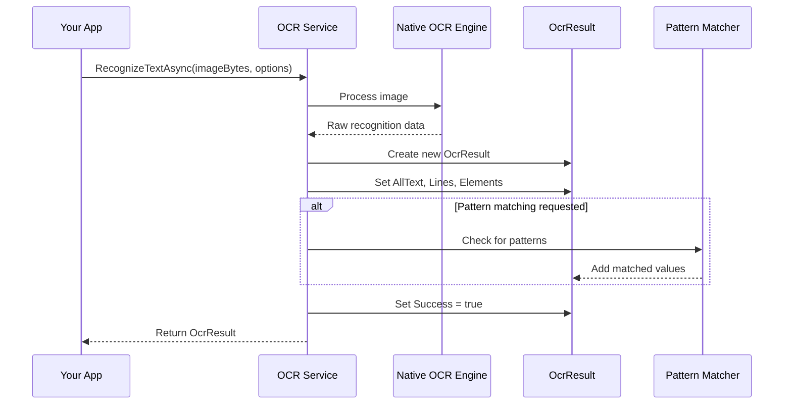

# Chapter 2: OcrResult

In the [previous chapter](01_iocrservice_interface_.md), we learned about the `IOcrService` interface, which provides a consistent way to perform OCR operations across different platforms. Now, let's explore what happens after the OCR process completes - how do we access and work with the recognized text?

## Introduction to OcrResult

Imagine you've just taken a photo of a receipt and used OCR to extract the text. The `OcrResult` class is like the detailed report you get back after this process. It doesn't just tell you "yes, I found some text" or "no, I didn't find anything." Instead, it gives you a complete breakdown of everything that was found in the image.

Think of `OcrResult` as a container that organizes all the information extracted from your image in a structured way, making it easy for you to access exactly what you need.

## Why Do We Need OcrResult?

Let's consider a practical example: you're building an app that scans business cards to automatically add contacts to your phone. After taking a photo of a business card, you need to:

1. Extract all the text from the card
2. Identify specific pieces of information (name, phone number, email, etc.)
3. Check if the recognition was successful
4. Know where each piece of text was located on the card

The `OcrResult` class solves these problems by providing a structured way to access all this information.

## Understanding OcrResult Through an Analogy

Think of `OcrResult` as a well-organized filing cabinet for the text found in your image:

- The top drawer (`AllText`) contains all the text combined into one document
- The middle drawer (`Lines`) separates the text into individual lines
- The bottom drawer (`Elements`) contains each word with details about its position and confidence
- There's also a special folder (`MatchedValues`) for any specific patterns you were looking for
- And a simple indicator light (`Success`) that tells you if the OCR process worked at all

## Key Properties of OcrResult

Let's explore the main properties of the `OcrResult` class:

### 1. Success

```csharp
public bool Success { get; set; }
```

This is a simple boolean (true/false) value that tells you whether the OCR process was successful. It's the first thing you should check when you get an `OcrResult`.

### 2. AllText

```csharp
public string AllText { get; set; }
```

This property contains all the recognized text from the image as a single string. It's useful when you just need the complete text without worrying about line breaks or word positions.

### 3. Lines

```csharp
public IList<string> Lines { get; set; }
```

This is a list of strings, where each string represents a line of text found in the image. The OCR engine tries to preserve the original line breaks from the image.

### 4. Elements

```csharp
public IList<OcrElement> Elements { get; set; }
```

This is a list of `OcrElement` objects, where each object represents a word or text element found in the image. Each element includes the text, its position (x, y coordinates), size (width, height), and a confidence score.

### 5. MatchedValues

```csharp
public IList<string> MatchedValues { get; set; }
```

This is a list of strings that matched any patterns you specified in your `OcrOptions`. For example, if you were looking for phone numbers, email addresses, or other specific formats, they would be collected here.

## The OcrElement Class

Inside `OcrResult`, there's a nested class called `OcrElement` that represents individual words or text elements:

```csharp
public class OcrElement
{
    public string Text { get; set; }
    public int X { get; set; }
    public int Y { get; set; }
    public int Width { get; set; }
    public int Height { get; set; }
    public float Confidence { get; set; }
}
```

Each `OcrElement` contains:
- `Text`: The actual text content of this element
- `X` and `Y`: The coordinates of the element in the image
- `Width` and `Height`: The size of the element
- `Confidence`: A value between 0 and 1 indicating how confident the OCR engine is about this recognition

## Using OcrResult: A Simple Example

Let's see how you might use `OcrResult` to extract text from a business card:

```csharp
// Get the OCR service (we learned this in Chapter 1)
IOcrService ocrService = /* get the service */;

// Initialize the service
await ocrService.InitAsync();

// Load an image of a business card
byte[] imageBytes = File.ReadAllBytes("business_card.jpg");

// Recognize text in the image
OcrResult result = await ocrService.RecognizeTextAsync(imageBytes);

// Check if OCR was successful
if (result.Success)
{
    // Print all the text
    Console.WriteLine("All text: " + result.AllText);
    
    // Print each line separately
    Console.WriteLine("\nLines:");
    foreach (string line in result.Lines)
    {
        Console.WriteLine($"  {line}");
    }
}
else
{
    Console.WriteLine("OCR failed to recognize text in the image.");
}
```

This code:
1. Loads an image of a business card
2. Performs OCR on the image
3. Checks if the OCR was successful
4. If successful, prints all the text and then each line separately

## Working with Elements and Their Positions

If you need to know where each word is located in the image (for example, to highlight them in a UI), you can use the `Elements` property:

```csharp
// Print information about each word
Console.WriteLine("\nWords:");
foreach (var element in result.Elements)
{
    Console.WriteLine($"  Text: {element.Text}");
    Console.WriteLine($"  Position: ({element.X}, {element.Y})");
    Console.WriteLine($"  Size: {element.Width}x{element.Height}");
    Console.WriteLine($"  Confidence: {element.Confidence:P}");
    Console.WriteLine();
}
```

This code iterates through each word found in the image and prints its text, position, size, and confidence score. The `:P` format specifier converts the confidence value to a percentage.

## Finding Specific Patterns in the Text

One powerful feature of the OCR library is the ability to look for specific patterns in the recognized text. For example, you might want to automatically extract phone numbers or email addresses from a business card.

Here's how you can use `OcrResult` with pattern matching:

```csharp
// Create OCR options with pattern matching for email and phone
var options = new OcrOptions(
    patternConfigs: new List<OcrPatternConfig>
    {
        new OcrPatternConfig(@"[a-zA-Z0-9._%+-]+@[a-zA-Z0-9.-]+\.[a-zA-Z]{2,}"), // Email
        new OcrPatternConfig(@"\(?\d{3}\)?[-.\s]?\d{3}[-.\s]?\d{4}") // Phone
    }
);

// Recognize text with pattern matching
OcrResult result = await ocrService.RecognizeTextAsync(imageBytes, options);

// Check for matched patterns
if (result.MatchedValues.Count > 0)
{
    Console.WriteLine("\nFound patterns:");
    foreach (string match in result.MatchedValues)
    {
        Console.WriteLine($"  {match}");
    }
}
```

This code:
1. Creates OCR options with regex patterns for email addresses and phone numbers
2. Performs OCR with these options
3. Checks if any patterns were matched
4. If matches were found, prints each matched value

## How OcrResult Works Behind the Scenes

When the OCR process completes, here's what happens to create and populate the `OcrResult`:



1. Your app calls `RecognizeTextAsync` with an image
2. The OCR service passes the image to the native OCR engine
3. The native engine returns raw recognition data
4. The OCR service creates a new `OcrResult` object
5. It populates the properties with the recognized text, lines, and elements
6. If pattern matching was requested, it checks for patterns and adds any matches
7. It sets `Success` to true (or false if there was a problem)
8. It returns the `OcrResult` to your app

## Creating an OcrResult in the Implementation

Here's a simplified example of how the OCR service might create an `OcrResult` internally:

```csharp
// Inside the platform-specific implementation of IOcrService
private OcrResult CreateOcrResult(NativeOcrData nativeData, OcrOptions options)
{
    // Create a new OcrResult
    var result = new OcrResult
    {
        Success = true,
        AllText = nativeData.FullText,
        Lines = nativeData.TextLines.ToList(),
        Elements = new List<OcrResult.OcrElement>()
    };
    
    // Add elements (words)
    foreach (var word in nativeData.Words)
    {
        result.Elements.Add(new OcrResult.OcrElement
        {
            Text = word.Text,
            X = word.BoundingBox.X,
            Y = word.BoundingBox.Y,
            Width = word.BoundingBox.Width,
            Height = word.BoundingBox.Height,
            Confidence = word.Confidence
        });
    }
    
    // Check for pattern matches if patterns were provided
    if (options?.PatternConfigs != null)
    {
        foreach (var config in options.PatternConfigs)
        {
            var match = OcrPatternMatcher.ExtractPattern(result.AllText, config);
            if (match != null)
            {
                result.MatchedValues.Add(match);
            }
        }
    }
    
    return result;
}
```

This code:
1. Creates a new `OcrResult` with the basic text information
2. Converts each word from the native OCR data into an `OcrElement`
3. Checks for pattern matches if any patterns were specified
4. Returns the completed `OcrResult`

## Practical Tips for Working with OcrResult

Here are some practical tips for getting the most out of `OcrResult`:

1. **Always check the `Success` property first** before trying to access other properties.

2. **Use `AllText` when you just need the complete text** and don't care about line breaks or word positions.

3. **Use `Lines` when you want to preserve the original line structure** of the text in the image.

4. **Use `Elements` when you need to know where each word is located** in the image, or when you need confidence scores.

5. **Use `MatchedValues` with pattern matching** to automatically extract specific information like phone numbers, email addresses, or other formatted data.

## Conclusion

In this chapter, we've explored the `OcrResult` class, which serves as a container for all the information extracted during the OCR process. We've seen how it provides structured access to the recognized text, from the complete text to individual lines and words, along with their positions and confidence scores.

We've also learned how to use pattern matching to automatically extract specific information from the recognized text, which can be incredibly useful for applications like business card scanning, receipt processing, and document analysis.

In the next chapter, we'll explore [OcrOptions](03_ocroptions_.md), which allows you to configure the OCR process to suit your specific needs, such as specifying languages, accuracy levels, and pattern matching.

## Key Takeaways

- `OcrResult` is a container for all the information extracted during OCR
- It provides access to the complete text (`AllText`), individual lines (`Lines`), and words with their positions (`Elements`)
- It tracks whether the OCR was successful (`Success`)
- It can automatically extract specific patterns from the text (`MatchedValues`)
- Always check the `Success` property before trying to access other properties

---

Generated by [AI Codebase Knowledge Builder](https://github.com/The-Pocket/Tutorial-Codebase-Knowledge)