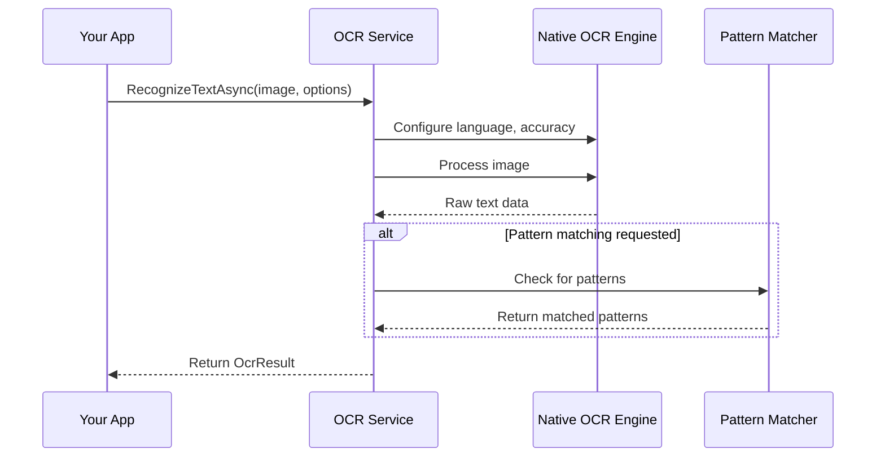

# Chapter 3: OcrOptions

In the [previous chapter](02_ocrresult_.md), we explored the `OcrResult` class, which contains all the information extracted during the OCR process. Now, let's learn how to customize the OCR process itself using the `OcrOptions` class.

## Introduction to OcrOptions

Imagine you're at a restaurant. You don't just say "I want food" - you specify exactly what dish you want, how you want it cooked, and any special requests. Similarly, when performing OCR, you often need to customize how the text recognition works to get the best results for your specific needs.

This is where `OcrOptions` comes in. It allows you to tell the OCR engine exactly how you want it to process your images.

## Why Do We Need OcrOptions?

Let's consider a practical example: you're building an app that scans receipts in different languages. You need to:

1. Tell the OCR engine which language to expect
2. Decide whether to prioritize speed or accuracy
3. Look for specific patterns like prices or dates
4. Validate the extracted information

Without `OcrOptions`, you'd be stuck with the default settings, which might not be optimal for your specific use case.

## Understanding OcrOptions Through an Analogy

Think of `OcrOptions` as your custom order at a coffee shop:

- Language setting is like specifying "espresso" vs. "americano" (the base)
- TryHard option is like saying "take your time and make it perfect" vs. "I'm in a hurry"
- Pattern matching is like adding specific flavors or toppings
- Custom validation is like asking the barista to check if your drink meets certain criteria

## Key Properties of OcrOptions

Let's explore the main properties of the `OcrOptions` class:

### 1. Language

```csharp
public string? Language { get; }
```

This property specifies which language the OCR engine should expect to find in the image. It uses BCP-47 language codes (like "en" for English, "fr" for French, etc.).

### 2. TryHard

```csharp
public bool TryHard { get; }
```

This is a simple boolean (true/false) value that tells the OCR engine whether to prioritize accuracy (true) or speed (false). If you set this to true, the OCR process might take longer but could produce more accurate results.

### 3. PatternConfigs

```csharp
public List<OcrPatternConfig> PatternConfigs { get; }
```

This is a list of pattern configurations that tell the OCR engine to look for specific text patterns in the image. Each `OcrPatternConfig` contains a regular expression pattern and an optional validation function.

### 4. CustomCallback

```csharp
public CustomOcrValidationCallback? CustomCallback { get; }
```

This is an optional callback function that can be used to validate the entire extracted text after the OCR process completes.

## The OcrPatternConfig Class

The `OcrPatternConfig` class is used to define patterns to look for in the recognized text:

```csharp
public class OcrPatternConfig
{
    public string RegexPattern { get; set; }
    public Func<string, bool> ValidationFunction { get; set; }
}
```

Each `OcrPatternConfig` contains:
- `RegexPattern`: A regular expression pattern to match in the text
- `ValidationFunction`: An optional function that validates the matched text

## Creating OcrOptions: Two Approaches

The OCR library provides two different ways to create `OcrOptions`, depending on which version of the library you're using:

### 1. Constructor Approach (Xamarin Version)

In the Xamarin version of the library, you create `OcrOptions` using constructors:

```csharp
// Simple options with just language and accuracy setting
var options = new OcrOptions(
    language: "en",  // English language
    tryHard: true    // Prioritize accuracy over speed
);

// More complex options with pattern matching
var options = new OcrOptions(
    language: "en",
    tryHard: true,
    patternConfig: new OcrPatternConfig(
        regexPattern: @"\d{3}-\d{2}-\d{4}", // Pattern for SSN
        validationFunction: text => text.Length == 11
    )
);
```

This code creates `OcrOptions` with:
1. English language recognition
2. High accuracy mode
3. A pattern to look for Social Security Numbers (in the second example)

### 2. Builder Pattern Approach (MAUI Version)

In the MAUI version of the library, you create `OcrOptions` using the builder pattern:

```csharp
// Create options using the builder pattern
var options = new OcrOptions.Builder()
    .SetLanguage("en")
    .SetTryHard(true)
    .AddPatternConfig(new OcrPatternConfig(
        regexPattern: @"\d{3}-\d{2}-\d{4}",
        validationFunction: text => text.Length == 11
    ))
    .Build();
```

This code does the same thing as the previous example, but uses the builder pattern, which allows for a more fluent and readable way to configure options.

## Using OcrOptions with IOcrService

Now that we know how to create `OcrOptions`, let's see how to use them with the [IOcrService](01_iocrservice_interface_.md) we learned about in Chapter 1:

```csharp
// Get the OCR service
IOcrService ocrService = /* get the service */;

// Initialize the service
await ocrService.InitAsync();

// Create OCR options
var options = new OcrOptions(
    language: "en",
    tryHard: true
);

// Load an image
byte[] imageBytes = File.ReadAllBytes("receipt.jpg");

// Recognize text with options
OcrResult result = await ocrService.RecognizeTextAsync(imageBytes, options);

// Check if OCR was successful
if (result.Success)
{
    Console.WriteLine("Recognized text: " + result.AllText);
}
```

This code:
1. Creates `OcrOptions` with English language and high accuracy
2. Loads an image from a file
3. Performs OCR on the image with the specified options
4. Checks if the OCR was successful and prints the recognized text

## Pattern Matching with OcrOptions

One of the most powerful features of `OcrOptions` is the ability to automatically extract specific patterns from the recognized text. Let's see how to use this feature:

```csharp
// Create options with pattern matching for email addresses
var options = new OcrOptions(
    language: "en",
    patternConfig: new OcrPatternConfig(
        regexPattern: @"[a-zA-Z0-9._%+-]+@[a-zA-Z0-9.-]+\.[a-zA-Z]{2,}",
        validationFunction: email => email.Contains("@")
    )
);

// Recognize text with pattern matching
OcrResult result = await ocrService.RecognizeTextAsync(imageBytes, options);

// Check for matched patterns
if (result.MatchedValues.Count > 0)
{
    Console.WriteLine("Found email addresses:");
    foreach (string email in result.MatchedValues)
    {
        Console.WriteLine($"  {email}");
    }
}
```

This code:
1. Creates `OcrOptions` with a pattern for email addresses
2. Performs OCR with these options
3. Checks if any email addresses were found
4. If found, prints each email address

## Multiple Pattern Matching

You can also look for multiple patterns at once:

```csharp
// Create options with multiple pattern matching
var options = new OcrOptions(
    language: "en",
    patternConfigs: new List<OcrPatternConfig>
    {
        // Email pattern
        new OcrPatternConfig(
            @"[a-zA-Z0-9._%+-]+@[a-zA-Z0-9.-]+\.[a-zA-Z]{2,}"
        ),
        
        // Phone pattern
        new OcrPatternConfig(
            @"\(?\d{3}\)?[-.\s]?\d{3}[-.\s]?\d{4}"
        )
    }
);
```

This code creates `OcrOptions` that will look for both email addresses and phone numbers in the recognized text.

## How OcrOptions Works Behind the Scenes

When you use `OcrOptions` with the OCR service, here's what happens:



1. Your app calls `RecognizeTextAsync` with an image and `OcrOptions`
2. The OCR service configures the native OCR engine based on the options
3. The image is processed by the native engine
4. If pattern matching was requested, the recognized text is checked for patterns
5. The results are returned to your app as an `OcrResult`

## The Implementation of OcrOptions

Let's look at how `OcrOptions` is implemented in the MAUI version of the library:

```csharp
public sealed class OcrOptions
{
    private OcrOptions(string? language, bool tryHard, 
                      List<OcrPatternConfig> patternConfigs, 
                      CustomOcrValidationCallback? customCallback)
    {
        Language = language;
        TryHard = tryHard;
        PatternConfigs = patternConfigs;
        CustomCallback = customCallback;
    }

    public CustomOcrValidationCallback? CustomCallback { get; }
    public string? Language { get; }
    public List<OcrPatternConfig> PatternConfigs { get; }
    public bool TryHard { get; }

    // Builder class implementation...
}
```

This code shows the private constructor and properties of the `OcrOptions` class. The constructor is private because the class uses the builder pattern, which we'll see next.

## The Builder Pattern in OcrOptions

The MAUI version of `OcrOptions` uses the builder pattern, which is implemented as a nested class:

```csharp
public class Builder
{
    private string? _language;
    private bool _tryHard;
    private List<OcrPatternConfig> _patternConfigs = new();
    private CustomOcrValidationCallback? _customCallback;

    public Builder SetLanguage(string language)
    {
        _language = language;
        return this;
    }

    public Builder SetTryHard(bool tryHard)
    {
        _tryHard = tryHard;
        return this;
    }

    // Other setter methods...

    public OcrOptions Build()
    {
        return new OcrOptions(_language, _tryHard, 
                             _patternConfigs, _customCallback);
    }
}
```

This code shows how the builder pattern works:
1. Each setter method updates a private field and returns the builder itself
2. This allows for method chaining (e.g., `builder.SetLanguage().SetTryHard()`)
3. The `Build()` method creates and returns the final `OcrOptions` object

## Practical Tips for Using OcrOptions

Here are some practical tips for getting the most out of `OcrOptions`:

1. **Set the language when you know it**: If you know what language to expect in the image, always specify it. This can significantly improve recognition accuracy.

2. **Use TryHard wisely**: Set `TryHard` to true when accuracy is more important than speed, but be aware that it might make the OCR process slower.

3. **Use pattern matching for structured data**: Pattern matching is perfect for extracting specific information like phone numbers, email addresses, dates, or prices.

4. **Combine multiple patterns**: You can look for multiple patterns at once by adding multiple pattern configurations.

5. **Use validation functions**: Validation functions can help filter out false positives by applying additional checks to matched patterns.

## Real-World Example: Receipt Scanner

Let's put everything together in a real-world example of a receipt scanner:

```csharp
// Create options for receipt scanning
var options = new OcrOptions(
    language: "en",
    tryHard: true,
    patternConfigs: new List<OcrPatternConfig>
    {
        // Total amount pattern (e.g., $123.45)
        new OcrPatternConfig(
            @"\$\d+\.\d{2}",
            amount => decimal.TryParse(amount.TrimStart('$'), out _)
        ),
        
        // Date pattern (e.g., 01/02/2023)
        new OcrPatternConfig(
            @"\d{1,2}/\d{1,2}/\d{4}",
            date => DateTime.TryParse(date, out _)
        )
    }
);

// Recognize text in the receipt image
OcrResult result = await ocrService.RecognizeTextAsync(receiptImageBytes, options);

// Extract information from the result
if (result.Success)
{
    Console.WriteLine("Receipt text: " + result.AllText);
    
    if (result.MatchedValues.Count > 0)
    {
        Console.WriteLine("Found important information:");
        foreach (string value in result.MatchedValues)
        {
            Console.WriteLine($"  {value}");
        }
    }
}
```

This code:
1. Creates `OcrOptions` for scanning receipts, looking for total amounts and dates
2. Performs OCR on a receipt image
3. Extracts and displays the important information found in the receipt

## Conclusion

In this chapter, we've explored the `OcrOptions` class, which allows you to customize the OCR process to suit your specific needs. We've seen how to specify the language, accuracy level, and patterns to look for in the recognized text.

We've also learned about the two different ways to create `OcrOptions` - using constructors in the Xamarin version and the builder pattern in the MAUI version. Both approaches allow you to configure the OCR process to get the best results for your specific use case.

In the next chapter, we'll explore the [OcrPatternMatcher](04_ocrpatternmatcher_.md) class, which is responsible for extracting specific patterns from the recognized text.

## Key Takeaways

- `OcrOptions` allows you to customize the OCR process
- You can specify the language, accuracy level, and patterns to look for
- The Xamarin version uses constructors to create `OcrOptions`
- The MAUI version uses the builder pattern for a more fluent API
- Pattern matching is a powerful feature for extracting specific information
- Validation functions can help filter out false positives

---

Generated by [AI Codebase Knowledge Builder](https://github.com/The-Pocket/Tutorial-Codebase-Knowledge)