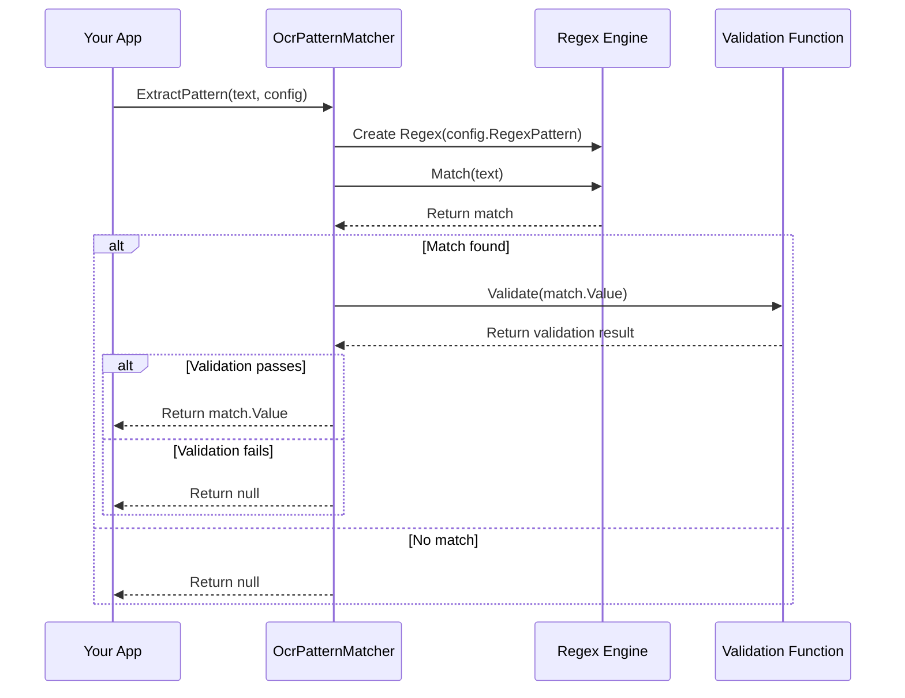

# Chapter 4: OcrPatternMatcher

In the [previous chapter](03_ocroptions_.md), we explored the `OcrOptions` class, which allows you to customize the OCR process. Now, let's dive into one of the most powerful features of our OCR library: the `OcrPatternMatcher`.

## Introduction to OcrPatternMatcher

Imagine you've just scanned a stack of business cards with your app. The OCR process successfully extracts all the text, but now you're faced with a challenge: how do you find just the phone numbers or email addresses among all that text? Manually searching through each card would be tedious and error-prone.

This is where `OcrPatternMatcher` comes in. It's like having a personal assistant who can quickly scan through documents and highlight exactly the information you're looking for.

## Why Do We Need OcrPatternMatcher?

Let's consider a practical example: you're building an app that helps users organize their receipts. After scanning a receipt, you want to automatically extract:

1. The total amount (e.g., $42.99)
2. The date (e.g., 05/15/2023)
3. The store name (e.g., Grocery Mart)

Without `OcrPatternMatcher`, you'd need to write complex code to search through the entire text for these specific pieces of information. The `OcrPatternMatcher` simplifies this process by allowing you to define patterns (using regular expressions) and automatically extract matching text.

## Understanding OcrPatternMatcher Through an Analogy

Think of `OcrPatternMatcher` as a gold prospector sifting through river sediment:

- The river sediment is the raw text extracted by OCR
- The sifting pan is the regular expression pattern
- The gold nuggets are the specific pieces of information you're looking for
- The validation function is like an expert who examines each nugget to confirm it's real gold

Just as a prospector can find valuable gold among ordinary rocks and sand, `OcrPatternMatcher` helps you find valuable information among ordinary text.

## How OcrPatternMatcher Works

At its core, `OcrPatternMatcher` is a utility class with a single, powerful method:

```csharp
public static string? ExtractPattern(string input, OcrPatternConfig config)
```

This method takes two parameters:
1. `input`: The text to search through (typically the OCR result text)
2. `config`: A configuration object that defines what to look for

It returns:
- The first matching text if a match is found and passes validation
- `null` if no match is found or the match fails validation

## The OcrPatternConfig Class

Before we dive into using `OcrPatternMatcher`, let's understand the `OcrPatternConfig` class that it works with:

```csharp
public class OcrPatternConfig
{
    public string RegexPattern { get; set; }
    public Func<string, bool> ValidationFunction { get; set; }
    
    public OcrPatternConfig(string regexPattern, 
                           Func<string, bool> validationFunction = null)
    {
        RegexPattern = regexPattern;
        ValidationFunction = validationFunction;
    }
}
```

This class has two main components:

1. `RegexPattern`: A regular expression pattern that defines what to look for
2. `ValidationFunction`: An optional function that validates the matched text

## Using OcrPatternMatcher: A Simple Example

Let's start with a simple example: extracting a phone number from text:

```csharp
// The text extracted from an OCR scan
string ocrText = "Contact John Doe at (555) 123-4567 or john@example.com";

// Create a pattern config for phone numbers
var phoneConfig = new OcrPatternConfig(
    regexPattern: @"\(?\d{3}\)?[-.\s]?\d{3}[-.\s]?\d{4}",
    validationFunction: text => text.Length >= 10
);

// Extract the phone number
string phoneNumber = OcrPatternMatcher.ExtractPattern(ocrText, phoneConfig);

// Output: (555) 123-4567
Console.WriteLine($"Found phone number: {phoneNumber}");
```

This code:
1. Defines a regular expression pattern that matches common phone number formats
2. Adds a simple validation function to ensure the match is at least 10 characters long
3. Uses `OcrPatternMatcher` to extract the first matching phone number from the text

## Adding Validation for Better Results

The validation function is a powerful feature that helps filter out false positives. Let's see a more complex example with email extraction:

```csharp
// The text extracted from an OCR scan
string ocrText = "Contact us at info@company.com or support@company.com";

// Create a pattern config for email addresses with validation
var emailConfig = new OcrPatternConfig(
    regexPattern: @"[a-zA-Z0-9._%+-]+@[a-zA-Z0-9.-]+\.[a-zA-Z]{2,}",
    validationFunction: email => 
    {
        // Validate that it's a company.com email
        return email.EndsWith("company.com");
    }
);

// Extract the email
string email = OcrPatternMatcher.ExtractPattern(ocrText, emailConfig);

// Output: info@company.com (the first matching email)
Console.WriteLine($"Found company email: {email}");
```

In this example, the validation function ensures that we only extract email addresses from the specific domain "company.com".

## Integrating OcrPatternMatcher with OcrOptions

While you can use `OcrPatternMatcher` directly as shown above, it's more common to use it indirectly through the [OcrOptions](03_ocroptions_.md) class we learned about in the previous chapter:

```csharp
// Create OCR options with pattern matching for receipts
var options = new OcrOptions(
    language: "en",
    patternConfigs: new List<OcrPatternConfig>
    {
        // Pattern for total amount (e.g., $42.99)
        new OcrPatternConfig(
            regexPattern: @"\$\d+\.\d{2}",
            validationFunction: amount => decimal.TryParse(amount.TrimStart('$'), out _)
        ),
        
        // Pattern for date (e.g., 05/15/2023)
        new OcrPatternConfig(
            regexPattern: @"\d{1,2}/\d{1,2}/\d{4}",
            validationFunction: date => DateTime.TryParse(date, out _)
        )
    }
);

// Perform OCR with these options
OcrResult result = await ocrService.RecognizeTextAsync(imageBytes, options);

// Access the matched values
foreach (string match in result.MatchedValues)
{
    Console.WriteLine($"Found: {match}");
}
```

When you use `OcrOptions` with pattern configs, the OCR service automatically:
1. Performs the OCR to extract text from the image
2. Uses `OcrPatternMatcher` to find all patterns in the extracted text
3. Adds the matched values to the `MatchedValues` property of the [OcrResult](02_ocrresult_.md)

## How OcrPatternMatcher Works Behind the Scenes

Let's look at what happens when `OcrPatternMatcher.ExtractPattern` is called:



1. Your app calls `ExtractPattern` with the text and a pattern config
2. `OcrPatternMatcher` creates a `Regex` object with the pattern from the config
3. It uses the regex to find the first match in the text
4. If a match is found, it calls the validation function (if provided)
5. If the validation passes (or if there's no validation function), it returns the matched text
6. If no match is found or validation fails, it returns null

## The Implementation of OcrPatternMatcher

Let's look at the actual implementation of `OcrPatternMatcher`:

```csharp
public static class OcrPatternMatcher
{
    public static string? ExtractPattern(string input, OcrPatternConfig config)
    {
        if (string.IsNullOrEmpty(config?.RegexPattern))
        {
            return null;
        }

        var regex = new Regex(config.RegexPattern);
        var match = regex.Match(input);

        if (match.Success && 
            (config.ValidationFunction == null || 
             config.ValidationFunction(match.Value)))
        {
            return match.Value;
        }

        return null;
    }
}
```

This code:
1. Checks if the input pattern is valid
2. Creates a `Regex` object with the pattern
3. Finds the first match in the input text
4. If a match is found, it checks if it passes validation
5. If everything passes, it returns the matched text; otherwise, it returns null

## Real-World Example: Receipt Scanner

Let's put everything together in a real-world example of a receipt scanner:

```csharp
// Get the OCR service
IOcrService ocrService = /* get the service */;

// Initialize the service
await ocrService.InitAsync();

// Create pattern configs for receipt information
var totalConfig = new OcrPatternConfig(
    regexPattern: @"Total:?\s*\$\d+\.\d{2}",
    validationFunction: text => text.Contains("$")
);

var dateConfig = new OcrPatternConfig(
    regexPattern: @"\d{1,2}/\d{1,2}/\d{4}",
    validationFunction: text => DateTime.TryParse(text, out _)
);

// Create OCR options with these patterns
var options = new OcrOptions(
    language: "en",
    tryHard: true,
    patternConfigs: new List<OcrPatternConfig> { totalConfig, dateConfig }
);

// Load a receipt image
byte[] imageBytes = File.ReadAllBytes("receipt.jpg");

// Perform OCR with pattern matching
OcrResult result = await ocrService.RecognizeTextAsync(imageBytes, options);

// Check the results
if (result.Success)
{
    Console.WriteLine("Receipt text: " + result.AllText);
    
    if (result.MatchedValues.Count > 0)
    {
        Console.WriteLine("\nExtracted information:");
        foreach (string value in result.MatchedValues)
        {
            Console.WriteLine($"  {value}");
        }
    }
}
```

This code:
1. Creates pattern configs for total amount and date
2. Creates OCR options with these patterns
3. Loads a receipt image
4. Performs OCR with pattern matching
5. Displays the extracted information

## Advanced Pattern Matching Techniques

Here are some advanced techniques for getting the most out of `OcrPatternMatcher`:

### 1. Using Capture Groups

You can use capture groups in your regex patterns to extract specific parts of a match:

```csharp
// Pattern config for extracting just the amount from "Total: $42.99"
var totalConfig = new OcrPatternConfig(
    regexPattern: @"Total:?\s*\$(\d+\.\d{2})",
    validationFunction: text => 
    {
        // Extract just the amount using a regex
        var match = Regex.Match(text, @"Total:?\s*\$(\d+\.\d{2})");
        if (match.Success && match.Groups.Count > 1)
        {
            // Return just the amount part
            return match.Groups[1].Value;
        }
        return text;
    }
);
```

### 2. Combining Multiple Patterns

You can combine multiple patterns to extract different types of information:

```csharp
// Create a list of pattern configs
var patternConfigs = new List<OcrPatternConfig>
{
    // Email pattern
    new OcrPatternConfig(@"[a-zA-Z0-9._%+-]+@[a-zA-Z0-9.-]+\.[a-zA-Z]{2,}"),
    
    // Phone pattern
    new OcrPatternConfig(@"\(?\d{3}\)?[-.\s]?\d{3}[-.\s]?\d{4}"),
    
    // Website pattern
    new OcrPatternConfig(@"https?://[a-zA-Z0-9.-]+\.[a-zA-Z]{2,}")
};

// Create OCR options with these patterns
var options = new OcrOptions(
    language: "en",
    patternConfigs: patternConfigs
);
```

### 3. Custom Validation Logic

You can implement complex validation logic in your validation functions:

```csharp
// Pattern config for credit card numbers with validation
var creditCardConfig = new OcrPatternConfig(
    regexPattern: @"\d{4}[-\s]?\d{4}[-\s]?\d{4}[-\s]?\d{4}",
    validationFunction: text => 
    {
        // Remove spaces and dashes
        string digits = text.Replace(" ", "").Replace("-", "");
        
        // Check if it's a valid length
        if (digits.Length != 16) return false;
        
        // Implement Luhn algorithm for credit card validation
        // (simplified for this example)
        return true;
    }
);
```

## Conclusion

In this chapter, we've explored the `OcrPatternMatcher` class, which helps you extract specific information from OCR results using regular expressions and validation functions. We've seen how it works behind the scenes and how to use it in real-world scenarios like receipt scanning.

The `OcrPatternMatcher` is a powerful tool that transforms raw OCR text into structured, actionable data. By defining patterns and validation functions, you can automatically extract exactly the information you need from any document.

In the next chapter, we'll explore the [OcrImplementation](05_ocrimplementation_.md) class, which is responsible for implementing the OCR functionality on different platforms.

## Key Takeaways

- `OcrPatternMatcher` helps you extract specific information from OCR results
- It uses regular expressions to match patterns and validation functions to verify matches
- You can use it directly or through the `OcrOptions` class
- Pattern matching transforms raw text into structured, actionable data
- You can combine multiple patterns to extract different types of information
- Validation functions help filter out false positives

---

Generated by [AI Codebase Knowledge Builder](https://github.com/The-Pocket/Tutorial-Codebase-Knowledge)