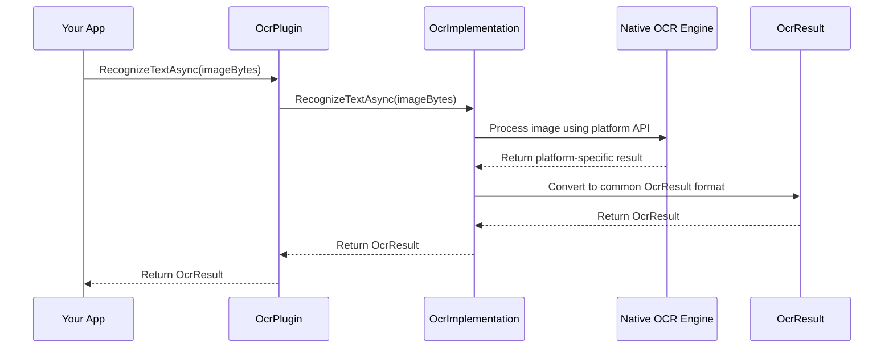

# Chapter 5: OcrImplementation

In the [previous chapter](04_ocrpatternmatcher_.md), we explored the `OcrPatternMatcher` class, which helps you extract specific information from OCR results. Now, let's dive into the heart of our OCR library: the platform-specific implementations that make everything work across different devices.

## Introduction to OcrImplementation

Imagine you've built an amazing app that can scan receipts to track expenses. You want your app to work perfectly whether your users have an iPhone, an Android phone, or a Windows device. But here's the challenge: each platform has its own way of doing OCR:

- iOS uses Apple's Vision framework
- Android uses Google's ML Kit
- Windows uses Windows.Media.OCR

This is where `OcrImplementation` comes in. It's like having a team of specialized translators who all speak different languages but can all translate into the same target language. Each implementation understands its native platform's OCR capabilities but presents them through the common [IOcrService](01_iocrservice_interface_.md) interface we learned about in Chapter 1.

## Why Do We Need OcrImplementation?

Let's consider a practical example: you're building a business card scanner app that needs to work on both iOS and Android. Without `OcrImplementation`, you'd need to:

1. Learn how to use Apple's Vision framework for iOS
2. Learn how to use Google's ML Kit for Android
3. Write completely different code for each platform
4. Maintain two separate codebases

With `OcrImplementation`, you:

1. Write your app code once using the common `IOcrService` interface
2. Let the platform-specific implementations handle the details
3. Your app works the same way across all platforms

## Understanding OcrImplementation Through an Analogy

Think of `OcrImplementation` as a power adapter for international travel:

- Different countries have different electrical outlets (like different platforms have different OCR APIs)
- A power adapter lets you plug your device into any outlet (like `OcrImplementation` lets your app use any platform's OCR)
- You don't need to know the electrical standards of each country (like you don't need to know the details of each platform's OCR API)
- Your device works the same way regardless of which country you're in (like your app works the same way regardless of which platform it's running on)

## How OcrImplementation Works

The `OcrImplementation` class is actually not a single class, but a set of platform-specific classes that all implement the same `IOcrService` interface. Each implementation is in a separate file with a platform-specific extension:

- `OcrImplementation.android.cs` for Android
- `OcrImplementation.macios.cs` for iOS/macOS
- `OcrImplementation.windows.cs` for Windows

When your app runs, the correct implementation is automatically selected based on the platform.

## Key Components of OcrImplementation

Let's look at the common elements across all implementations:

### 1. Platform-Specific OCR Engine

Each implementation uses the native OCR engine for its platform:

- Android: Google's ML Kit Text Recognition
- iOS: Apple's Vision framework with VNRecognizeTextRequest
- Windows: Windows.Media.OCR

### 2. Common Interface Methods

Despite using different OCR engines, all implementations provide the same methods defined in the `IOcrService` interface:

```csharp
// Initialize the OCR service
Task InitAsync(CancellationToken ct = default);

// Recognize text in an image
Task<OcrResult> RecognizeTextAsync(byte[] imageData, bool tryHard = false, CancellationToken ct = default);
Task<OcrResult> RecognizeTextAsync(byte[] imageData, OcrOptions options, CancellationToken ct = default);

// Start asynchronous recognition
Task StartRecognizeTextAsync(byte[] imageData, OcrOptions options, CancellationToken ct = default);
```

### 3. Result Processing

Each implementation converts the platform-specific OCR results into the common [OcrResult](02_ocrresult_.md) format we learned about in Chapter 2.

## Using OcrImplementation (Indirectly)

As a user of the OCR library, you typically won't interact with `OcrImplementation` directly. Instead, you'll use it through the [OcrPlugin](06_ocrplugin_.md) or the [UseOcr Extension Method](07_useocr_extension_method_.md), which we'll learn about in the next chapters.

However, it's helpful to understand what happens behind the scenes when you use the OCR service:

```csharp
// This is what you write in your app
IOcrService ocrService = /* get the service */;
OcrResult result = await ocrService.RecognizeTextAsync(imageBytes);

// Behind the scenes, this calls the platform-specific implementation
// For example, on Android:
// result = await OcrImplementation.android.RecognizeTextAsync(imageBytes);
```

## A Peek Inside: Android Implementation

Let's take a look at a simplified version of the Android implementation to understand how it works:

```csharp
// From OcrImplementation.android.cs
internal class OcrImplementation : IOcrService
{
    // Platform-specific OCR engine
    private static ITextRecognizer? s_textRecognizer;
    
    public async Task<OcrResult> RecognizeTextAsync(byte[] imageData, OcrOptions options, CancellationToken ct = default)
    {
        // Convert byte array to Android bitmap
        using var srcBitmap = await BitmapFactory.DecodeByteArrayAsync(imageData, 0, imageData.Length);
        
        // Create ML Kit input image
        using var srcImage = InputImage.FromBitmap(srcBitmap, 0);
        
        // Get or create text recognizer based on options
        ITextRecognizer textScanner;
        if (options.TryHard)
        {
            // Use more accurate but slower recognizer
            textScanner = TextRecognition.GetClient(new TextRecognizerOptions.Builder()
                .SetExecutor(/* executor */)
                .Build());
        }
        else
        {
            // Use faster on-device recognizer
            textScanner = TextRecognition.GetClient(TextRecognizerOptions.DefaultOptions);
        }
        
        // Process the image
        var result = await textScanner.Process(srcImage).AsAsync<Text>();
        
        // Convert ML Kit result to OcrResult
        return ProcessOcrResult(result, options);
    }
    
    // Other methods...
}
```

This code:
1. Converts the input image bytes to an Android bitmap
2. Creates an ML Kit input image from the bitmap
3. Chooses the appropriate text recognizer based on the options
4. Processes the image with ML Kit
5. Converts the ML Kit result to our common `OcrResult` format

## A Peek Inside: iOS Implementation

Now let's look at a simplified version of the iOS implementation:

```csharp
// From OcrImplementation.macios.cs
class OcrImplementation : IOcrService
{
    public async Task<OcrResult> RecognizeTextAsync(byte[] imageData, OcrOptions options, CancellationToken ct = default)
    {
        // Convert byte array to UIImage
        using var srcImage = ImageFromByteArray(imageData);
        var imageSize = srcImage.Size;
        
        // Create Vision request
        using var recognizeTextRequest = new VNRecognizeTextRequest((request, error) =>
        {
            // Handle completion...
        });
        
        // Configure request based on options
        recognizeTextRequest.RecognitionLevel = options.TryHard 
            ? VNRequestTextRecognitionLevel.Accurate 
            : VNRequestTextRecognitionLevel.Fast;
            
        // Set language if specified
        if (!string.IsNullOrEmpty(options.Language))
        {
            recognizeTextRequest.RecognitionLanguages = new[] { options.Language };
        }
        
        // Process the image
        using var ocrHandler = new VNImageRequestHandler(srcImage.CGImage, new NSDictionary());
        ocrHandler.Perform(new VNRequest[] { recognizeTextRequest }, out var error);
        
        // Result is processed in the request completion handler
        // and returned via TaskCompletionSource
    }
    
    // Other methods...
}
```

This code:
1. Converts the input image bytes to a UIImage
2. Creates a Vision text recognition request
3. Configures the request based on the options
4. Processes the image with Vision
5. Converts the Vision result to our common `OcrResult` format

## A Peek Inside: Windows Implementation

Finally, let's look at a simplified version of the Windows implementation:

```csharp
// From OcrImplementation.windows.cs
class OcrImplementation : IOcrService
{
    public async Task<OcrResult> RecognizeTextAsync(byte[] imageData, OcrOptions options, CancellationToken ct = default)
    {
        // Create OCR engine
        var ocrEngine = OcrEngine.TryCreateFromUserProfileLanguages();
        
        // Convert byte array to stream
        using var stream = new InMemoryRandomAccessStream();
        await stream.WriteAsync(imageData.AsBuffer());
        stream.Seek(0);
        
        // Decode image
        var decoder = await BitmapDecoder.CreateAsync(stream);
        var softwareBitmap = await decoder.GetSoftwareBitmapAsync();
        
        // Process the image
        var ocrResult = await ocrEngine.RecognizeAsync(softwareBitmap);
        
        // Convert Windows OCR result to OcrResult
        return ProcessOcrResult(ocrResult, options);
    }
    
    // Other methods...
}
```

This code:
1. Creates a Windows OCR engine
2. Converts the input image bytes to a stream and then to a bitmap
3. Processes the image with Windows OCR
4. Converts the Windows OCR result to our common `OcrResult` format

## How OcrImplementation Works Behind the Scenes

When you call a method on the OCR service, here's what happens:



1. Your app calls a method on the OCR plugin
2. The plugin forwards the call to the platform-specific implementation
3. The implementation uses the native OCR engine to process the image
4. The native engine returns a platform-specific result
5. The implementation converts the result to the common `OcrResult` format
6. The result is returned to your app

## Processing OCR Results

One of the most important parts of each implementation is the `ProcessOcrResult` method, which converts the platform-specific OCR results into our common `OcrResult` format:

```csharp
// Simplified example from Android implementation
private static OcrResult ProcessOcrResult(Text textResult, OcrOptions options)
{
    var ocrResult = new OcrResult();
    
    // Set the full text
    ocrResult.AllText = textResult.GetText();
    
    // Extract lines and elements
    foreach (var block in textResult.TextBlocks)
    {
        foreach (var line in block.Lines)
        {
            ocrResult.Lines.Add(line.Text);
            
            foreach (var element in line.Elements)
            {
                var ocrElement = new OcrElement
                {
                    Text = element.Text,
                    Confidence = element.Confidence,
                    X = element.BoundingBox.Left,
                    Y = element.BoundingBox.Top,
                    Width = element.BoundingBox.Width(),
                    Height = element.BoundingBox.Height()
                };
                ocrResult.Elements.Add(ocrElement);
            }
        }
    }
    
    // Apply pattern matching if requested
    foreach (var config in options.PatternConfigs)
    {
        var match = OcrPatternMatcher.ExtractPattern(ocrResult.AllText, config);
        if (!string.IsNullOrEmpty(match))
        {
            ocrResult.MatchedValues.Add(match);
        }
    }
    
    ocrResult.Success = true;
    return ocrResult;
}
```

This code:
1. Creates a new `OcrResult`
2. Sets the full text from the OCR result
3. Extracts lines and elements (words) with their positions
4. Applies pattern matching if requested
5. Sets the success flag and returns the result

## Platform-Specific Features and Limitations

Each platform has its own unique features and limitations:

### Android (ML Kit)
- Supports both on-device (faster) and cloud-based (more accurate) recognition
- Requires downloading language models for on-device recognition
- Good support for Latin-based scripts on-device, wider language support in the cloud

### iOS (Vision)
- Excellent accuracy for Latin-based scripts
- Fast on-device recognition
- Language support varies by iOS version

### Windows (Windows.Media.OCR)
- Good integration with Windows apps
- Language support depends on installed language packs
- Limited configuration options compared to other platforms

## Real-World Example: Receipt Scanner

Let's put everything together in a real-world example of a receipt scanner that works across platforms:

```csharp
// Get the OCR service (we'll learn how in the next chapter)
IOcrService ocrService = /* get the service */;

// Initialize the service
await ocrService.InitAsync();

// Create options for receipt scanning
var options = new OcrOptions(
    language: "en",
    tryHard: true,
    patternConfig: new OcrPatternConfig(
        regexPattern: @"\$\d+\.\d{2}", // Pattern for prices
        validationFunction: text => decimal.TryParse(text.TrimStart('$'), out _)
    )
);

// Load a receipt image (e.g., from camera or file)
byte[] imageBytes = /* get image bytes */;

// Recognize text in the receipt
OcrResult result = await ocrService.RecognizeTextAsync(imageBytes, options);

// Check if OCR was successful
if (result.Success)
{
    Console.WriteLine("Receipt text: " + result.AllText);
    
    // Display matched prices
    if (result.MatchedValues.Count > 0)
    {
        Console.WriteLine("Found prices:");
        foreach (string price in result.MatchedValues)
        {
            Console.WriteLine($"  {price}");
        }
    }
}
```

This code:
1. Gets the OCR service (we'll learn how in the next chapter)
2. Initializes the service
3. Creates options for receipt scanning with a pattern for prices
4. Loads a receipt image
5. Recognizes text in the receipt
6. Displays the full text and any matched prices

The beauty of this code is that it works exactly the same way on Android, iOS, and Windows, even though the underlying OCR engines are completely different.

## Conclusion

In this chapter, we've explored the `OcrImplementation` classes, which are the platform-specific implementations of the OCR service. We've seen how they use the native OCR capabilities of each platform while presenting a unified interface to your app.

The `OcrImplementation` classes are the bridge between your app and the platform's native OCR capabilities. They handle all the platform-specific details so you can write your app code once and have it work across all platforms.

In the next chapter, we'll explore the [OcrPlugin](06_ocrplugin_.md) class, which provides a convenient way to access the OCR service in your app.

## Key Takeaways

- `OcrImplementation` provides platform-specific implementations of the `IOcrService` interface
- Each implementation uses the native OCR capabilities of its platform
- All implementations present the same interface to your app
- The correct implementation is automatically selected based on the platform
- You typically don't interact with `OcrImplementation` directly, but through the `OcrPlugin` or `UseOcr` extension method
- The implementations handle all the platform-specific details so you can write your app code once

---

Generated by [AI Codebase Knowledge Builder](https://github.com/The-Pocket/Tutorial-Codebase-Knowledge)