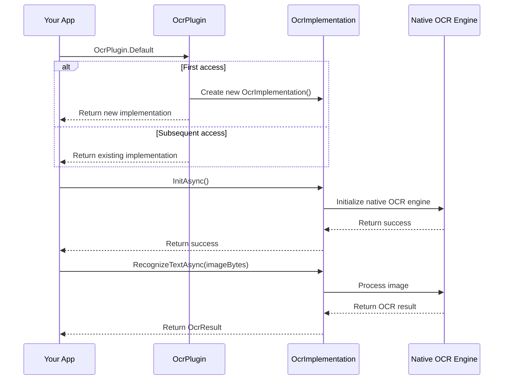

# Chapter 6: OcrPlugin

In the [previous chapter](05_ocrimplementation_.md), we explored the platform-specific implementations that make OCR work across different devices. Now, let's learn about a simpler way to access OCR functionality in your app: the `OcrPlugin` class.

## Introduction to OcrPlugin

Imagine you're building an app that needs to scan business cards. You want to access OCR functionality from different parts of your app - maybe from a camera page, a file picker page, and a history page. Without a central access point, you'd need to:

1. Create a new OCR service instance in each page
2. Pass the service between pages
3. Make sure it's properly initialized everywhere

This is where `OcrPlugin` comes in. It's like a reception desk at a hotel - a single, well-known location where you can always go to access services. No matter where you are in your app, you can easily access OCR functionality through the `OcrPlugin`.

## Why Do We Need OcrPlugin?

Let's consider a practical example: you're building a document scanning app with multiple pages:

- A camera page for taking photos of documents
- A gallery page for selecting existing photos
- A history page showing previously scanned documents

Without `OcrPlugin`, you'd need to:
1. Create an OCR service in each page or pass it between pages
2. Handle initialization in multiple places
3. Deal with dependency injection or service location

With `OcrPlugin`, you simply:
1. Access the OCR service through `OcrPlugin.Default` from anywhere
2. Initialize it once at app startup
3. Use it whenever you need OCR functionality

## Understanding OcrPlugin Through an Analogy

Think of `OcrPlugin` as a vending machine for OCR services:

- The vending machine is always in the same location (static access)
- You don't need to build your own vending machine (no need to create instances)
- It always dispenses the same product (consistent service)
- It's ready to use whenever you need it (pre-initialized)

## How OcrPlugin Works

The `OcrPlugin` class is remarkably simple:

```csharp
public static class OcrPlugin
{
    private static IOcrService? s_defaultImplementation;

    public static IOcrService Default =>
        s_defaultImplementation ??= new OcrImplementation();

    internal static void SetDefault(IOcrService? implementation) =>
        s_defaultImplementation = implementation;
}
```

This code:
1. Defines a static class called `OcrPlugin`
2. Maintains a private static field for the default implementation
3. Provides a public `Default` property that returns the default implementation
4. Provides an internal method to set the default implementation

The magic happens in the `Default` property. If the default implementation hasn't been set yet (`s_defaultImplementation` is null), it creates a new instance of `OcrImplementation` and returns it. Otherwise, it returns the existing instance.

## Using OcrPlugin: A Simple Example

Let's see how to use `OcrPlugin` to extract text from an image:

```csharp
// Access the OCR service through OcrPlugin
IOcrService ocrService = OcrPlugin.Default;

// Initialize the service (only needed once)
await ocrService.InitAsync();

// Load an image
byte[] imageBytes = File.ReadAllBytes("document.jpg");

// Recognize text in the image
OcrResult result = await ocrService.RecognizeTextAsync(imageBytes);

// Check if OCR was successful
if (result.Success)
{
    Console.WriteLine("Recognized text: " + result.AllText);
}
```

This code:
1. Gets the OCR service through `OcrPlugin.Default`
2. Initializes the service
3. Loads an image from a file
4. Recognizes text in the image
5. Displays the recognized text if successful

The beauty of this approach is that you can access the OCR service from anywhere in your app without needing to pass it around or inject it.

## Using OcrPlugin with Options

You can also use `OcrPlugin` with [OcrOptions](03_ocroptions_.md) to customize the OCR process:

```csharp
// Access the OCR service through OcrPlugin
IOcrService ocrService = OcrPlugin.Default;

// Initialize the service
await ocrService.InitAsync();

// Create options for OCR
var options = new OcrOptions(
    language: "en",
    tryHard: true,
    patternConfig: new OcrPatternConfig(
        regexPattern: @"\d{3}-\d{2}-\d{4}", // Pattern for SSN
        validationFunction: text => text.Length == 11
    )
);

// Load an image
byte[] imageBytes = File.ReadAllBytes("document.jpg");

// Recognize text with options
OcrResult result = await ocrService.RecognizeTextAsync(imageBytes, options);

// Check for matched patterns
if (result.MatchedValues.Count > 0)
{
    Console.WriteLine($"Found SSN: {result.MatchedValues[0]}");
}
```

This code:
1. Gets the OCR service through `OcrPlugin.Default`
2. Initializes the service
3. Creates OCR options with a pattern for Social Security Numbers
4. Loads an image from a file
5. Recognizes text in the image with the specified options
6. Displays any matched SSNs

## How OcrPlugin Works Behind the Scenes

When you use `OcrPlugin`, here's what happens:



1. Your app requests the OCR service through `OcrPlugin.Default`
2. If this is the first access, `OcrPlugin` creates a new implementation; otherwise, it returns the existing one
3. Your app initializes the service, which initializes the native OCR engine
4. Your app calls methods on the service, which are forwarded to the native OCR engine
5. The results are returned to your app

## Initializing OcrPlugin in Your App

It's a good practice to initialize the OCR service when your app starts, so it's ready to use when needed:

```csharp
// In your App.xaml.cs or similar startup code
protected override async void OnStart()
{
    base.OnStart();
    
    // Initialize the OCR service
    await OcrPlugin.Default.InitAsync();
    
    // Now the OCR service is ready to use throughout your app
}
```

This code initializes the OCR service when your app starts, so it's ready to use whenever you need it.

## Using OcrPlugin in Different Pages

One of the main benefits of `OcrPlugin` is that you can access it from anywhere in your app. Here's how you might use it in different pages:

```csharp
// In your CameraPage.xaml.cs
private async void ScanButton_Clicked(object sender, EventArgs e)
{
    // Take a photo
    var photo = await TakePhotoAsync();
    
    // Convert photo to byte array
    byte[] imageBytes = ConvertToByteArray(photo);
    
    // Recognize text using OcrPlugin
    var result = await OcrPlugin.Default.RecognizeTextAsync(imageBytes);
    
    // Display the result
    ResultLabel.Text = result.AllText;
}

// In your GalleryPage.xaml.cs
private async void ImageSelected(object sender, SelectedItemChangedEventArgs e)
{
    // Get the selected image
    var image = e.SelectedItem as ImageSource;
    
    // Convert image to byte array
    byte[] imageBytes = ConvertToByteArray(image);
    
    // Recognize text using OcrPlugin
    var result = await OcrPlugin.Default.RecognizeTextAsync(imageBytes);
    
    // Display the result
    ResultLabel.Text = result.AllText;
}
```

In both pages, you access the OCR service through `OcrPlugin.Default` without needing to pass it between pages or inject it.

## Advanced Usage: Setting a Custom Implementation

In some cases, you might want to use a custom implementation of `IOcrService` instead of the default one. For example, you might want to use a mock implementation for testing or a custom implementation with additional features.

While the `SetDefault` method is internal, you can still set a custom implementation through dependency injection in the MAUI version of the library:

```csharp
// In your MauiProgram.cs
public static MauiApp CreateMauiApp()
{
    var builder = MauiApp.CreateBuilder();
    
    // Register your custom OCR service
    builder.Services.AddSingleton<IOcrService, MyCustomOcrService>();
    
    // Add the OCR plugin
    builder.UseOcr();
    
    return builder.Build();
}
```

This code registers your custom OCR service with the dependency injection container and then calls the `UseOcr` extension method, which we'll learn about in the [next chapter](07_useocr_extension_method_.md).

## Real-World Example: Business Card Scanner

Let's put everything together in a real-world example of a business card scanner:

```csharp
public class BusinessCardScannerViewModel : INotifyPropertyChanged
{
    private string _recognizedText = "";
    private string _email = "";
    private string _phone = "";
    
    public string RecognizedText
    {
        get => _recognizedText;
        set
        {
            _recognizedText = value;
            OnPropertyChanged();
        }
    }
    
    public string Email
    {
        get => _email;
        set
        {
            _email = value;
            OnPropertyChanged();
        }
    }
    
    public string Phone
    {
        get => _phone;
        set
        {
            _phone = value;
            OnPropertyChanged();
        }
    }
    
    public async Task ScanBusinessCardAsync(byte[] imageBytes)
    {
        // Create options for business card scanning
        var options = new OcrOptions(
            language: "en",
            tryHard: true,
            patternConfigs: new List<OcrPatternConfig>
            {
                // Email pattern
                new OcrPatternConfig(
                    @"[a-zA-Z0-9._%+-]+@[a-zA-Z0-9.-]+\.[a-zA-Z]{2,}"
                ),
                
                // Phone pattern
                new OcrPatternConfig(
                    @"\(?\d{3}\)?[-.\s]?\d{3}[-.\s]?\d{4}"
                )
            }
        );
        
        // Recognize text using OcrPlugin
        var result = await OcrPlugin.Default.RecognizeTextAsync(imageBytes, options);
        
        // Update properties
        RecognizedText = result.AllText;
        
        // Extract email and phone if found
        foreach (string match in result.MatchedValues)
        {
            if (match.Contains("@"))
            {
                Email = match;
            }
            else if (match.All(c => char.IsDigit(c) || c == '-' || c == '(' || c == ')' || c == ' '))
            {
                Phone = match;
            }
        }
    }
    
    // INotifyPropertyChanged implementation...
}
```

This view model:
1. Maintains properties for the recognized text, email, and phone
2. Provides a method to scan a business card
3. Uses `OcrPlugin.Default` to access the OCR service
4. Creates options with patterns for email and phone
5. Updates the properties with the recognized text and extracted information

## Conclusion

In this chapter, we've explored the `OcrPlugin` class, which provides a convenient way to access OCR functionality from anywhere in your app. We've seen how it maintains a default implementation that can be accessed through the `Default` property, eliminating the need for dependency injection or service location in many cases.

The `OcrPlugin` is a simple but powerful tool that makes it easy to add OCR capabilities to your app. By providing a static access point to OCR functionality, it allows you to focus on your app's features rather than worrying about how to access the OCR service.

In the next chapter, we'll explore the [UseOcr Extension Method](07_useocr_extension_method_.md), which provides a more modern approach to registering the OCR service with dependency injection in MAUI apps.

## Key Takeaways

- `OcrPlugin` provides a static access point to OCR functionality
- You can access the OCR service from anywhere in your app through `OcrPlugin.Default`
- It maintains a single instance of the OCR service, eliminating the need to create multiple instances
- It's a convenient alternative to dependency injection for accessing OCR functionality
- You should initialize the OCR service at app startup to ensure it's ready when needed
- In MAUI apps, you can register a custom implementation through dependency injection

---

Generated by [AI Codebase Knowledge Builder](https://github.com/The-Pocket/Tutorial-Codebase-Knowledge)