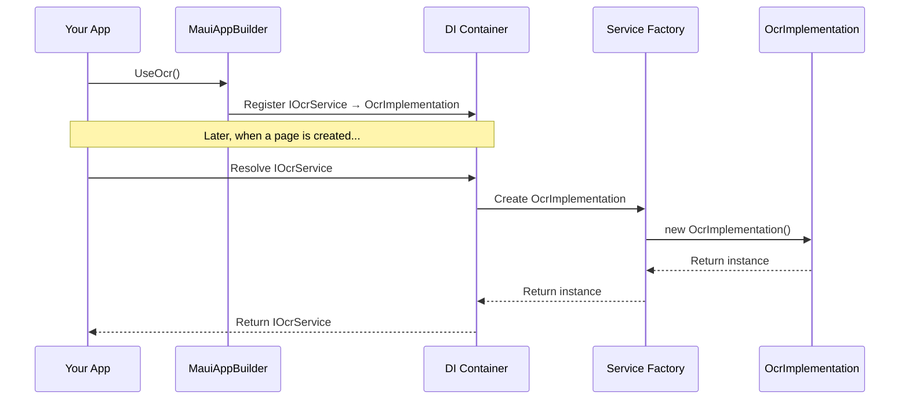

# Chapter 7: UseOcr Extension Method

In the [previous chapter](06_ocrplugin_.md), we explored the `OcrPlugin` class, which provides a convenient way to access OCR functionality from anywhere in your app. Now, let's learn about a more modern approach to integrating OCR into your MAUI applications: the `UseOcr` extension method.

## Introduction to UseOcr Extension Method

Imagine you're building a house. You need to connect various systems like electricity, plumbing, and internet. Each connection requires specific knowledge and expertise. In a similar way, when building a MAUI app, you need to connect various services and features.

The `UseOcr` extension method is like calling a professional electrician who knows exactly how to wire your home's electrical system. With just one line of code, it properly connects the OCR functionality to your MAUI application, so everything works seamlessly together.

## Why Do We Need UseOcr Extension Method?

Let's consider a practical example: you're building a receipt scanning app using .NET MAUI. You need to:

1. Make OCR functionality available throughout your app
2. Ensure the correct platform-specific implementation is used
3. Follow modern dependency injection patterns
4. Keep your code clean and maintainable

Without the `UseOcr` extension method, you'd need to:
1. Manually register the OCR service with the dependency injection container
2. Ensure the correct platform-specific implementation is selected
3. Write boilerplate code in your app's startup

With the `UseOcr` extension method, you simply add one line of code to your app's startup, and everything is taken care of automatically.

## Understanding UseOcr Through an Analogy

Think of the `UseOcr` extension method as plugging a new appliance into your home's electrical system:

- Your MAUI app is like your home
- The OCR functionality is like a new appliance (e.g., a refrigerator)
- The `UseOcr` method is like the power outlet
- Calling the method is like plugging in the appliance

Just as plugging in an appliance connects it to your home's electrical system, calling `UseOcr` connects the OCR functionality to your app's service system.

## How UseOcr Works

The `UseOcr` extension method is remarkably simple:

```csharp
public static MauiAppBuilder UseOcr(this MauiAppBuilder builder)
{
    // Register the IOcrService implementation with the DI container
    builder.Services.AddSingleton<IOcrService, OcrImplementation>();

    return builder;
}
```

This code:
1. Extends the `MauiAppBuilder` class with a new method called `UseOcr`
2. Registers the `OcrImplementation` class as the implementation of `IOcrService` with the dependency injection container
3. Returns the builder to allow for method chaining

Despite its simplicity, this method plays a crucial role in making OCR functionality available throughout your MAUI app.

## Using UseOcr in Your MAUI App

Using the `UseOcr` extension method is incredibly simple. You just need to add one line of code to your app's startup:

```csharp
// In your MauiProgram.cs
public static MauiApp CreateMauiApp()
{
    var builder = MauiApp.CreateBuilder();
    builder
        .UseMauiApp<App>()
        .ConfigureFonts(fonts =>
        {
            fonts.AddFont("OpenSans-Regular.ttf", "OpenSansRegular");
            fonts.AddFont("OpenSans-Semibold.ttf", "OpenSansSemibold");
        })
        .UseOcr(); // Add this line to enable OCR

    return builder.Build();
}
```

This code:
1. Creates a new MAUI app builder
2. Configures the app with standard settings
3. Calls the `UseOcr` extension method to register the OCR service
4. Builds and returns the MAUI app

With just that one line of code, OCR functionality is now available throughout your app through dependency injection.

## Accessing OCR After Using UseOcr

Once you've called `UseOcr` in your app's startup, you can access the OCR service in your pages or view models through dependency injection:

```csharp
public class ScanPage : ContentPage
{
    private readonly IOcrService _ocrService;

    // The IOcrService is automatically injected by the DI container
    public ScanPage(IOcrService ocrService)
    {
        _ocrService = ocrService;
        InitializeComponent();
    }

    private async void ScanButton_Clicked(object sender, EventArgs e)
    {
        // Take a photo
        var photo = await TakePhotoAsync();
        
        // Convert photo to byte array
        byte[] imageBytes = ConvertToByteArray(photo);
        
        // Recognize text using the injected OCR service
        var result = await _ocrService.RecognizeTextAsync(imageBytes);
        
        // Display the result
        ResultLabel.Text = result.AllText;
    }
}
```

This code:
1. Declares a private field to hold the OCR service
2. Accepts the OCR service through the constructor (constructor injection)
3. Uses the OCR service to recognize text in a photo

The beauty of this approach is that you don't need to worry about creating or accessing the OCR service - it's automatically provided by the dependency injection container.

## How UseOcr Works Behind the Scenes

When you call `UseOcr` and then access the OCR service, here's what happens:



1. During app startup, your app calls `UseOcr` on the MAUI app builder
2. The builder registers `OcrImplementation` as the implementation of `IOcrService` with the dependency injection container
3. Later, when a page or view model requests an `IOcrService` through its constructor
4. The DI container creates a new instance of `OcrImplementation` (or returns an existing one for singletons)
5. The instance is passed to the page or view model

## The Implementation of UseOcr

Let's look at the actual implementation of the `UseOcr` extension method in the library:

```csharp
// From BuilderExtensions.cs
namespace Plugin.Maui.OCR;

public static class OcrServiceExtensions
{
    public static MauiAppBuilder UseOcr(this MauiAppBuilder builder)
    {
        // Register the IOcrService implementation with the DI container.
        // This ensures that whenever IOcrService is injected, the specific 
        // platform implementation is provided.
        builder.Services.AddSingleton<IOcrService, OcrImplementation>();

        return builder;
    }
}
```

This code:
1. Defines a static class called `OcrServiceExtensions`
2. Defines an extension method called `UseOcr` for the `MauiAppBuilder` class
3. Registers `OcrImplementation` as a singleton implementation of `IOcrService`
4. Returns the builder to allow for method chaining

The key part is `AddSingleton<IOcrService, OcrImplementation>()`, which tells the DI container to create a single instance of `OcrImplementation` and return it whenever an `IOcrService` is requested.

## UseOcr vs. OcrPlugin: Which to Use?

Now that we've learned about both `UseOcr` and [OcrPlugin](06_ocrplugin_.md), you might be wondering which one to use in your app. Here's a comparison:

### UseOcr (Dependency Injection Approach)
- **Pros:**
  - Modern approach that follows MAUI best practices
  - Works well with other services that use dependency injection
  - Makes testing easier by allowing you to inject mock services
  - Cleaner architecture with explicit dependencies
- **Cons:**
  - Requires passing the service to each class that needs it
  - Slightly more setup code

### OcrPlugin (Static Access Approach)
- **Pros:**
  - Simpler to use with direct access from anywhere
  - No need to pass the service between classes
  - Works well in smaller apps with simpler architecture
- **Cons:**
  - Less testable because it's harder to replace with mock services
  - Not as clean architecturally
  - Doesn't follow modern dependency injection patterns

In general, we recommend using `UseOcr` for new MAUI apps, as it follows modern best practices and provides more flexibility. However, `OcrPlugin` is still a valid option, especially for smaller apps or if you prefer the simplicity of static access.

## Real-World Example: Receipt Scanner

Let's put everything together in a real-world example of a receipt scanner using the `UseOcr` approach:

```csharp
// In MauiProgram.cs
public static MauiApp CreateMauiApp()
{
    var builder = MauiApp.CreateBuilder();
    builder
        .UseMauiApp<App>()
        .UseOcr(); // Register OCR service
    
    // Register pages and view models
    builder.Services.AddTransient<ScanPage>();
    builder.Services.AddTransient<ScanViewModel>();
    
    return builder.Build();
}

// In ScanViewModel.cs
public class ScanViewModel
{
    private readonly IOcrService _ocrService;
    
    public ScanViewModel(IOcrService ocrService)
    {
        _ocrService = ocrService;
    }
    
    public async Task<string> ScanReceiptAsync(byte[] imageBytes)
    {
        // Create options for receipt scanning
        var options = new OcrOptions(
            language: "en",
            patternConfig: new OcrPatternConfig(
                @"\$\d+\.\d{2}" // Pattern for prices
            )
        );
        
        // Recognize text in the receipt
        var result = await _ocrService.RecognizeTextAsync(imageBytes, options);
        
        // Return the total amount if found
        if (result.MatchedValues.Count > 0)
        {
            return $"Total: {result.MatchedValues[0]}";
        }
        
        return "No total found";
    }
}
```

This code:
1. Registers the OCR service using `UseOcr` in the app's startup
2. Creates a view model that accepts the OCR service through its constructor
3. Uses the OCR service to scan receipts and extract the total amount

## Advanced Usage: Registering a Custom Implementation

In some cases, you might want to use a custom implementation of `IOcrService` instead of the default one. For example, you might want to add logging, caching, or other features to the OCR service.

You can do this by registering your custom implementation before calling `UseOcr`:

```csharp
// In MauiProgram.cs
public static MauiApp CreateMauiApp()
{
    var builder = MauiApp.CreateBuilder();
    builder
        .UseMauiApp<App>()
        .ConfigureFonts(fonts =>
        {
            fonts.AddFont("OpenSans-Regular.ttf", "OpenSansRegular");
            fonts.AddFont("OpenSans-Semibold.ttf", "OpenSansSemibold");
        });
    
    // Register your custom OCR service
    builder.Services.AddSingleton<IOcrService, MyCustomOcrService>();
    
    // Call UseOcr (it won't override your custom registration)
    builder.UseOcr();
    
    return builder.Build();
}
```

This code:
1. Registers your custom OCR service with the DI container
2. Calls `UseOcr`, which would normally register the default implementation
3. Because your custom registration comes first, it takes precedence

The `UseOcr` method is designed to be safe to call even if you've already registered a custom implementation. It won't override your custom registration.

## Conclusion

In this chapter, we've explored the `UseOcr` extension method, which provides a modern, clean way to integrate OCR functionality into your MAUI applications. We've seen how it registers the OCR service with the dependency injection container, making it available throughout your app.

The `UseOcr` extension method is a small but powerful tool that follows MAUI best practices and makes it easy to add OCR capabilities to your app. By providing a simple, one-line integration point, it allows you to focus on your app's features rather than worrying about how to wire up the OCR service.

In the next chapter, we'll explore a [MainPage (Sample App)](08_mainpage__sample_app__.md) that demonstrates how to use OCR in a real-world scenario.

## Key Takeaways

- `UseOcr` is an extension method that registers the OCR service with the dependency injection container
- It provides a modern, clean way to integrate OCR functionality into your MAUI applications
- You can access the OCR service through constructor injection in your pages and view models
- It follows MAUI best practices and makes testing easier
- You can register a custom implementation of `IOcrService` if needed
- It's designed to be safe to call even if you've already registered a custom implementation

---

Generated by [AI Codebase Knowledge Builder](https://github.com/The-Pocket/Tutorial-Codebase-Knowledge)