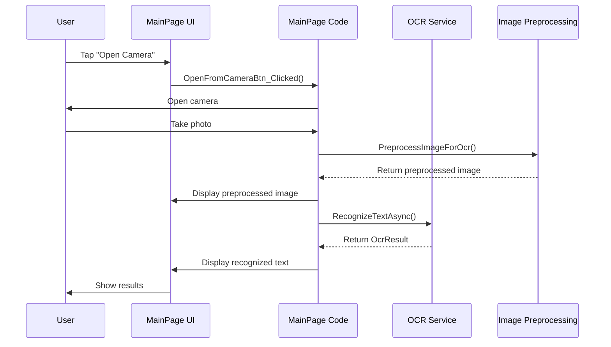

# Chapter 8: MainPage (Sample App)

In the [previous chapter](07_useocr_extension_method_.md), we explored the `UseOcr` extension method, which provides a modern way to integrate OCR functionality into your MAUI applications. Now, let's see how all these concepts come together in a real-world application by exploring the sample app's MainPage.

## Introduction to the Sample App

Imagine you've just learned about a powerful new tool, but you're not quite sure how to use it in practice. That's where a sample app comes in! The MainPage in our OCR sample app serves as a practical demonstration of how to use the OCR library in a real application.

Think of it like a test drive at a car dealership - it gives you a chance to see the OCR library in action before you implement it in your own app.

## Understanding the Sample App Through an Analogy

Think of the sample app as a cooking show:
- The chef (the sample app) demonstrates how to use various kitchen tools (OCR features)
- The audience (you, the developer) watches to learn techniques
- The recipe (the code) is available for you to replicate later
- The finished dish (the working app) shows what's possible with these tools

## Key Features of the Sample App

The MainPage of our sample app demonstrates several important features:

1. **Image Capture**: Taking photos with the device camera
2. **File Selection**: Choosing existing images from the device
3. **Text Recognition**: Extracting text from images
4. **Image Preprocessing**: Enhancing images to improve OCR accuracy
5. **Results Display**: Showing the recognized text to the user

Let's explore each of these features one by one.

## The User Interface

First, let's take a look at the basic structure of the MainPage:

```csharp
public partial class MainPage
{
    private readonly IOcrService _ocr;
    private byte[] _originalImageData;
    private byte[] _preprocessedImageData;
    
    public MainPage(IOcrService feature)
    {
        InitializeComponent();
        _ocr = feature;
    }
    
    protected override async void OnAppearing()
    {
        base.OnAppearing();
        await _ocr.InitAsync();
    }
    
    // Other methods...
}
```

This code shows the basic structure of the MainPage class:
1. It has a private field `_ocr` to hold the OCR service
2. It accepts the OCR service through its constructor (dependency injection)
3. It initializes the OCR service when the page appears

The UI is divided into several sections:
- A tab control to switch between camera and file input
- Buttons to capture or select images
- A preview area to display the selected image
- A results area to display the recognized text
- Controls for image preprocessing

## Capturing Images from the Camera

One of the main features of the sample app is the ability to capture images using the device's camera:

```csharp
private async void OpenFromCameraBtn_Clicked(object sender, EventArgs e)
{
    if (MediaPicker.Default.IsCaptureSupported)
    {
        var photo = await MediaPicker.Default.CapturePhotoAsync();

        if (photo == null)
        {
            return;
        }

        var result = await ProcessPhoto(photo);
        ResultLbl.Text = result.AllText;
        NoImagePlaceholder.IsVisible = false;
    }
    else
    {
        await DisplayAlert("Sorry", "Image capture is not supported on this device.", "OK");
    }
}
```

This code:
1. Checks if the device supports capturing photos
2. Opens the camera to take a photo
3. Processes the photo using the OCR service
4. Displays the recognized text in the results area

## Selecting Images from Files

The sample app also allows users to select existing images from their device:

```csharp
private async void OpenFromFileBtn_Clicked(object sender, EventArgs e)
{
    var photo = await MediaPicker.Default.PickPhotoAsync();

    if (photo != null)
    {
        var result = await ProcessPhoto(photo);
        ResultLbl.Text = result.AllText;
        NoImagePlaceholder.IsVisible = false;
    }
}
```

This code:
1. Opens the file picker to select a photo
2. Processes the selected photo using the OCR service
3. Displays the recognized text in the results area

## Processing Photos

Both the camera and file selection features use a common method to process photos:

```csharp
private async Task<OcrResult> ProcessPhoto(FileResult photo)
{
    try
    {
        ShowLoading("Reading image...");

        // Open a stream to the photo
        await using var sourceStream = await photo.OpenReadAsync();

        // Create a byte array to hold the image data
        _originalImageData = new byte[sourceStream.Length];
        
        // Read the stream into the byte array
        var dataLength = await sourceStream.ReadAsync(_originalImageData);

        ShowLoading("Preprocessing image...");
        _preprocessedImageData = await PreprocessImageForOcr(_originalImageData);

        await DisplayImage(_preprocessedImageData);

        var options = new OcrOptions.Builder()
            .SetTryHard(TryHardSwitch.IsToggled)
            .Build();

        // Process the image data using the OCR service
        ShowLoading("Extracting text...");
        return await _ocr.RecognizeTextAsync(_preprocessedImageData, options);
    }
    finally
    {
        HideLoading();
    }
}
```

This code:
1. Shows a loading indicator with a message
2. Opens a stream to the selected photo
3. Reads the photo data into a byte array
4. Preprocesses the image to improve OCR accuracy
5. Displays the preprocessed image in the preview area
6. Creates OCR options based on user settings
7. Processes the image using the OCR service
8. Hides the loading indicator and returns the result

## Image Preprocessing

One of the most important features of the sample app is image preprocessing, which can significantly improve OCR accuracy:

```csharp
private static async Task<byte[]> PreprocessImageForOcr(byte[] imageData)
{
    await using var ms = new MemoryStream(imageData);
    using var image = await Image.LoadAsync<L8>(ms);

    // Resize large images to improve processing speed
    const int MaxDimension = 1500;
    if (image.Width > MaxDimension || image.Height > MaxDimension)
    {
        var ratio = Math.Min((float)MaxDimension / image.Width, 
                            (float)MaxDimension / image.Height);
        var newWidth = (int)(image.Width * ratio);
        var newHeight = (int)(image.Height * ratio);
        image.Mutate(x => x.Resize(newWidth, newHeight));
    }

    // Apply preprocessing steps
    image.Mutate(x => x
            .Contrast(1.2f)         // Boost contrast
            .GaussianBlur(1.1f)     // Slight blur to reduce noise
            .BinaryThreshold(0.45f) // Convert to black and white
    );

    // Convert back to byte array
    using var resultMs = new MemoryStream();
    await image.SaveAsPngAsync(resultMs);
    return resultMs.ToArray();
}
```

This code:
1. Loads the image from the byte array
2. Resizes large images to improve processing speed
3. Applies several preprocessing steps:
   - Increases contrast to make text more visible
   - Applies a slight blur to reduce noise
   - Converts the image to black and white
4. Saves the preprocessed image back to a byte array

## Advanced Image Enhancement

The sample app also includes a button to apply more advanced image enhancement techniques:

```csharp
private async void EnhanceImageBtn_Clicked(object sender, EventArgs e)
{
    try
    {
        if (_originalImageData == null)
        {
            return;
        }

        ShowLoading("Enhancing image...");
        EnhanceImageBtn.IsEnabled = false;

        try
        {
            // Apply advanced preprocessing
            _preprocessedImageData = ApplyAdvancedPreprocessing(_originalImageData);

            // Display the enhanced image
            await DisplayImage(_preprocessedImageData);

            // Re-run OCR on the enhanced image
            ShowLoading("Running OCR on enhanced image...");
            var options = new OcrOptions.Builder()
                .SetTryHard(TryHardSwitch.IsToggled)
                .Build();
            var result = await _ocr.RecognizeTextAsync(_preprocessedImageData, options);

            // Update the results
            ResultLbl.Text = result.AllText;
        }
        finally
        {
            EnhanceImageBtn.IsEnabled = true;
        }
    }
    finally
    {
        HideLoading();
    }
}
```

This code:
1. Checks if an image has been loaded
2. Shows a loading indicator and disables the enhance button
3. Applies advanced preprocessing to the original image
4. Displays the enhanced image in the preview area
5. Runs OCR on the enhanced image
6. Updates the results with the new recognized text
7. Re-enables the enhance button and hides the loading indicator

## Using Events for Asynchronous Recognition

The sample app also demonstrates how to use events for asynchronous OCR recognition:

```csharp
private async void OpenFromCameraUseEventBtn_Clicked(object sender, EventArgs e)
{
    if (MediaPicker.Default.IsCaptureSupported)
    {
        var photo = await MediaPicker.Default.CapturePhotoAsync();

        if (photo == null)
        {
            return;
        }

        _ocr.RecognitionCompleted += OnRecognitionCompleted;
        await StartProcessingPhoto(photo);
    }
    else
    {
        await DisplayAlert("Sorry", "Image capture is not supported on this device.", "OK");
    }
}

private void OnRecognitionCompleted(object sender, OcrCompletedEventArgs e)
{
    // Remove the event handler to avoid multiple subscriptions
    _ocr.RecognitionCompleted -= OnRecognitionCompleted;

    // Update UI on the main thread
    MainThread.BeginInvokeOnMainThread(() =>
    {
        ResultLbl.Text = e is { IsSuccessful: true, Result: not null }
            ? e.Result.AllText
            : $"Error: {(!string.IsNullOrEmpty(e.ErrorMessage) ? e.ErrorMessage : "Unknown")}";

        NoImagePlaceholder.IsVisible = false;
    });
}
```

This code:
1. Captures a photo using the device's camera
2. Subscribes to the `RecognitionCompleted` event of the OCR service
3. Starts processing the photo asynchronously
4. When recognition completes, updates the UI with the results

## How the Sample App Works Behind the Scenes

When you use the sample app to recognize text in an image, here's what happens:



1. The user taps the "Open Camera" button
2. The app opens the device's camera
3. The user takes a photo
4. The app preprocesses the image to improve OCR accuracy
5. The app displays the preprocessed image in the preview area
6. The app sends the preprocessed image to the OCR service
7. The OCR service recognizes text in the image
8. The app displays the recognized text in the results area

## Putting It All Together

The sample app demonstrates how to use all the components of the OCR library together:

1. It uses the [IOcrService Interface](01_iocrservice_interface_.md) to access OCR functionality
2. It receives [OcrResult](02_ocrresult_.md) objects containing the recognized text
3. It creates [OcrOptions](03_ocroptions_.md) to customize the OCR process
4. It indirectly uses [OcrPatternMatcher](04_ocrpatternmatcher_.md) through the OCR options
5. It relies on the platform-specific [OcrImplementation](05_ocrimplementation_.md) behind the scenes
6. It can access the OCR service through [OcrPlugin](06_ocrplugin_.md) or the [UseOcr Extension Method](07_useocr_extension_method_.md)

## Learning from the Sample App

The sample app is designed to be a learning tool. Here are some ways you can use it to learn about OCR:

1. **Run the app**: Install and run the sample app on your device to see OCR in action
2. **Experiment with different images**: Try scanning different types of text to see how well OCR works
3. **Try different preprocessing options**: See how image preprocessing affects OCR accuracy
4. **Read the code**: Study the sample app's code to understand how to implement OCR in your own app
5. **Modify the app**: Make changes to the sample app to experiment with different features

## Implementing OCR in Your Own App

Now that you've seen how the sample app uses OCR, you can implement similar functionality in your own app:

1. Add the OCR library to your app using NuGet
2. Register the OCR service using the [UseOcr Extension Method](07_useocr_extension_method_.md)
3. Inject the [IOcrService Interface](01_iocrservice_interface_.md) into your pages or view models
4. Add UI for capturing or selecting images
5. Process images using the OCR service
6. Display the recognized text to the user

## Conclusion

In this chapter, we've explored the MainPage of the sample app, which demonstrates how to use the OCR library in a real application. We've seen how to capture images from the camera, select images from files, preprocess images to improve OCR accuracy, and display the recognized text to the user.

The sample app serves as a practical example of how to use all the components of the OCR library together, from the [IOcrService Interface](01_iocrservice_interface_.md) to the [OcrResult](02_ocrresult_.md) and [OcrOptions](03_ocroptions_.md). By studying and experimenting with the sample app, you can learn how to implement OCR in your own applications.

Now that you've completed all the chapters in this tutorial, you have a solid understanding of how to use the OCR library in your own applications. You can refer back to specific chapters as needed when implementing OCR features in your projects.

## Key Takeaways

- The sample app demonstrates how to use the OCR library in a real application
- It shows how to capture images from the camera and select images from files
- It demonstrates how to preprocess images to improve OCR accuracy
- It shows how to display the recognized text to the user
- It serves as a practical example of how to use all the components of the OCR library together
- You can learn from the sample app by running it, experimenting with it, and studying its code

---

Generated by [AI Codebase Knowledge Builder](https://github.com/The-Pocket/Tutorial-Codebase-Knowledge)