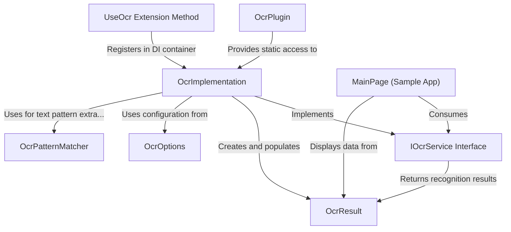

# Tutorial: ocr

This project provides **cross-platform OCR (Optical Character Recognition)** functionality for mobile and desktop applications. It enables developers to **extract text from images** with a consistent API across different platforms (Android, iOS, Windows). The library handles platform-specific implementations behind a common interface, supports **text pattern matching** (like finding emails or phone numbers), and offers options to balance between speed and accuracy. The sample app demonstrates practical usage including **image preprocessing** to improve recognition quality.

**Source Repository:** [https://github.com/kfrancis/ocr](https://github.com/kfrancis/ocr)

## Chapters

1. [IOcrService Interface
](01_iocrservice_interface_.md)
2. [OcrResult
](02_ocrresult_.md)
3. [OcrOptions
](03_ocroptions_.md)
4. [OcrPatternMatcher
](04_ocrpatternmatcher_.md)
5. [OcrImplementation
](05_ocrimplementation_.md)
6. [OcrPlugin
](06_ocrplugin_.md)
7. [UseOcr Extension Method
](07_useocr_extension_method_.md)
8. [MainPage (Sample App)
](08_mainpage__sample_app__.md)

---

Generated by [AI Codebase Knowledge Builder](https://github.com/The-Pocket/Tutorial-Codebase-Knowledge)